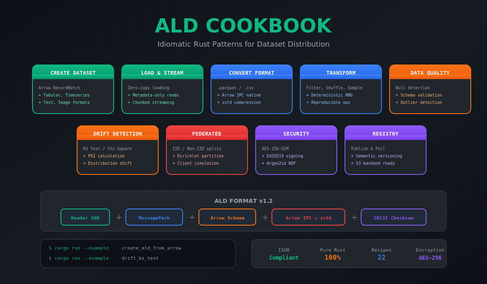

# ALD Cookbook

> Production recipes for dataset distribution — secure, verifiable, and reproducible ML data pipelines in pure Rust

[](https://github.com/paiml/ald-cookbook/actions/workflows/ci.yml)
[](https://opensource.org/licenses/MIT)
[](https://www.rust-lang.org/)



## Overview

ALD Cookbook provides **22 production-ready recipes** across 10 categories for working with the Alimentar Dataset Format (`.ald`). Each recipe is isolated, idempotent, and verified with property-based tests following **IIUR Principles**.

### Key Capabilities

- **Arrow IPC Core**: Native Arrow format with zstd compression
- **Format Conversion**: Parquet, CSV to/from ALD
- **Data Transforms**: Filter, shuffle, sample with deterministic RNG
- **Drift Detection**: KS test, PSI for data quality monitoring
- **Federated Splits**: IID and Dirichlet-based client partitioning
- **Security**: AES-256-GCM encryption and Ed25519 signing

## Installation

Add to your `Cargo.toml`:

```toml
[dependencies]
ald-cookbook = "0.1"
```

With optional features:

```toml
[dependencies]
ald-cookbook = { version = "0.1", features = ["encryption", "signing"] }
```

## Quick Start

```rust
use ald_cookbook::prelude::*;

fn main() -> Result<()> {
    // Create a dataset
    let batch = create_sample_batch()?;

    // Save as ALD
    save(&batch, DatasetType::Tabular, "data.ald", SaveOptions::new())?;

    // Load back
    let loaded = load("data.ald")?;
    println!("Loaded {} rows", loaded.num_rows());

    Ok(())
}
```

## Recipe Categories

```
┌─────────────────────────────────────────────────────────────────┐
│                    ALD Cookbook (22 Recipes)                    │
├─────────────────────────────────────────────────────────────────┤
│  A: Creation (5)      │  B: Loading (2)     │  C: Conversion (2)│
│  D: Transforms (3)    │  E: Quality (1)     │  F: Drift (2)     │
│  G: Federated (2)     │  H: Security (1)    │  I: Registry (2)  │
│  L: CLI Tools (1)     │                     │                   │
├─────────────────────────────────────────────────────────────────┤
│                       ALD Format v1.2                           │
│              (Arrow IPC + zstd + MessagePack Metadata)          │
├─────────────────────────────────────────────────────────────────┤
│                      IIUR Principles                            │
│           (Isolated, Idempotent, Useful, Reproducible)          │
└─────────────────────────────────────────────────────────────────┘
```

### Category Overview

| Category | Recipes | Description |
|----------|---------|-------------|
| **A: Dataset Creation** | 5 | Create ALD from Arrow, tabular, timeseries, text, image data |
| **B: Loading** | 2 | Basic loading and metadata-only reads |
| **C: Format Conversion** | 2 | Convert Parquet and CSV to ALD format |
| **D: Data Transforms** | 3 | Filter, shuffle, and sample operations |
| **E: Data Quality** | 1 | Null detection and data validation |
| **F: Drift Detection** | 2 | KS test and PSI for distribution drift |
| **G: Federated Learning** | 2 | IID and Dirichlet splits for FL |
| **H: Security** | 1 | Ed25519 digital signatures |
| **I: Registry** | 2 | Publish and pull from local registry |
| **L: CLI Tools** | 1 | Dataset inspection utility |

## Examples

```bash
# Category A: Dataset Creation
cargo run --example create_ald_from_arrow
cargo run --example create_ald_tabular
cargo run --example create_ald_timeseries

# Category C: Format Conversion
cargo run --example convert_parquet_to_ald
cargo run --example convert_csv_to_ald

# Category D: Data Transforms
cargo run --example transform_filter
cargo run --example transform_shuffle

# Category F: Drift Detection
cargo run --example drift_ks_test
cargo run --example drift_psi

# Category H: Security (requires feature)
cargo run --example sign_ald_ed25519 --features signing
```

## Usage

### Basic Dataset Operations

```rust
use ald_cookbook::prelude::*;

fn main() -> Result<()> {
    // Create an isolated context for recipe execution
    let mut ctx = RecipeContext::new("my_recipe")?;

    // Generate deterministic data using seeded RNG
    let data: Vec<f64> = (0..100).map(|_| ctx.rng.gen()).collect();

    // Create Arrow RecordBatch
    let batch = create_batch_from_data(&data)?;

    // Save to ALD format
    let path = ctx.path("output.ald");
    save(&batch, DatasetType::Tabular, &path, SaveOptions::new())?;

    Ok(())
    // Temp directory cleaned up automatically
}
```

### Data Transforms

```rust
use ald_cookbook::prelude::*;
use ald_cookbook::transforms;

fn main() -> Result<()> {
    let batch = load("data.ald")?;

    // Filter rows where value > 50.0
    let filtered = transforms::filter_gt_f64(&batch, "value", 50.0)?;

    // Shuffle with deterministic RNG
    let mut rng = StdRng::seed_from_u64(42);
    let shuffled = transforms::shuffle(&filtered, &mut rng)?;

    // Sample 100 rows
    let sampled = transforms::sample(&shuffled, 100, &mut rng, false)?;

    Ok(())
}
```

### Drift Detection

```rust
use ald_cookbook::prelude::*;
use ald_cookbook::drift;

fn main() -> Result<()> {
    let reference = load("reference.ald")?;
    let current = load("current.ald")?;

    // Kolmogorov-Smirnov test
    let ks = drift::ks_test(&reference, &current, "score")?;
    println!("KS statistic: {:.4}, p-value: {:.4}", ks.statistic, ks.p_value);

    // Population Stability Index
    let psi = drift::psi(&reference, &current, "score", 10)?;
    println!("PSI: {:.4} ({})", psi.psi, psi.interpretation());

    Ok(())
}
```

## ALD Format Specification

The Alimentar Dataset Format (`.ald`) is a binary format optimized for ML datasets:

```
┌──────────────────────────────────────────────────────────────┐
│ Header (34 bytes)                                            │
│   Magic: "ALDF" (0x464C4441)                                 │
│   Version: 1.2                                               │
│   Flags: encryption, signing, streaming, compressed          │
├──────────────────────────────────────────────────────────────┤
│ Metadata Section (MessagePack)                               │
│   name, description, created_at, row_count, schema_hash      │
├──────────────────────────────────────────────────────────────┤
│ Schema Section (Arrow IPC)                                   │
│   Full Arrow schema with field metadata                      │
├──────────────────────────────────────────────────────────────┤
│ Payload Section (Arrow IPC + zstd)                           │
│   Compressed Arrow RecordBatch data                          │
├──────────────────────────────────────────────────────────────┤
│ Checksum (CRC32)                                             │
│   Integrity verification over all preceding data             │
└──────────────────────────────────────────────────────────────┘
```

## Design Principles

This cookbook applies Toyota Production System principles to data engineering:

| Principle | Application |
|-----------|-------------|
| **Jidoka** | Built-in quality via Rust type system and property tests |
| **Muda** | Zero-copy operations eliminate processing waste |
| **Heijunka** | Consistent recipe structure across all categories |
| **Poka-Yoke** | Deterministic RNG prevents non-reproducible results |
| **Kaizen** | Continuous improvement via 95%+ test coverage |

## IIUR Principles

Every recipe follows the IIUR principles:

| Principle | Description |
|-----------|-------------|
| **Isolated** | Uses `tempfile::tempdir()` for all I/O, no global state |
| **Idempotent** | Fixed RNG seeds produce identical output on every run |
| **Useful** | Real production use cases, copy-paste ready code |
| **Reproducible** | Works on Linux, macOS, WASM; pinned dependencies |

## Quality Standards

Every recipe is verified against a 10-point QA checklist:

- `cargo run` succeeds (Exit Code 0)
- `cargo test` passes with property-based tests
- Deterministic output (reproducible)
- No temp files leaked
- Memory usage stable
- Clippy clean (`-D warnings`)

## Development

```bash
# Run all tests
cargo test

# Run specific example
cargo run --example create_ald_from_arrow

# Check code quality
cargo clippy -- -D warnings
cargo fmt --check

# Run benchmarks
cargo bench

# Generate documentation
cargo doc --no-deps --open
```

## Feature Flags

| Feature | Description |
|---------|-------------|
| `default` | Core ALD operations |
| `encryption` | AES-256-GCM dataset encryption |
| `signing` | Ed25519 digital signatures |
| `streaming` | Chunked loading for large datasets |
| `browser` | WASM target for browser use |
| `hf-hub` | HuggingFace Hub integration |
| `s3` | S3 backend for registry |
| `full` | All features enabled |

## Architecture

```
ald-cookbook/
├── src/
│   ├── lib.rs              # Public API and prelude
│   ├── format.rs           # ALD format read/write
│   ├── context.rs          # Recipe isolation (tempdir, RNG)
│   ├── transforms.rs       # Data transformations
│   ├── drift.rs            # Distribution drift detection
│   ├── federated.rs        # Federated learning splits
│   ├── quality.rs          # Data quality checks
│   ├── convert.rs          # Format conversion
│   ├── registry.rs         # Dataset registry
│   ├── encryption.rs       # AES-256-GCM encryption
│   ├── signing.rs          # Ed25519 signatures
│   └── error.rs            # Error types
├── examples/
│   ├── dataset_creation/   # Category A: 5 recipes
│   ├── loading/            # Category B: 2 recipes
│   ├── conversion/         # Category C: 2 recipes
│   ├── transforms/         # Category D: 3 recipes
│   ├── quality/            # Category E: 1 recipe
│   ├── drift/              # Category F: 2 recipes
│   ├── federated/          # Category G: 2 recipes
│   ├── security/           # Category H: 1 recipe
│   ├── registry/           # Category I: 2 recipes
│   └── cli/                # Category L: 1 recipe
├── benches/                # Criterion benchmarks
└── docs/
    ├── specifications/     # ALD format specification
    └── qa/                 # QA checklists
```

## License

MIT License — see [LICENSE](LICENSE) for details.

## Links

- [GitHub Repository](https://github.com/paiml/ald-cookbook)
- [Sovereign AI Stack](https://github.com/paiml/sovereign-ai-stack-book)

---

**ALD Cookbook** — Production recipes for dataset distribution.
