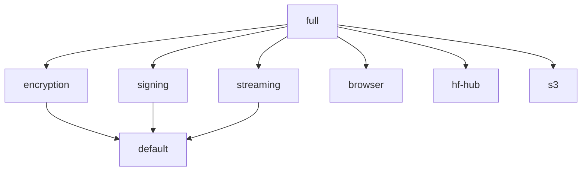

# Feature Flags

## Available Features

| Feature | Description | Dependencies |
|---------|-------------|--------------|
| `default` | Core functionality | arrow, zstd, serde |
| `encryption` | AES-256-GCM encryption | aes-gcm, argon2 |
| `signing` | Ed25519 signatures | ed25519-dalek |
| `streaming` | Chunked loading | (none) |
| `browser` | WASM target | wasm-bindgen, js-sys |
| `hf-hub` | HuggingFace integration | hf-hub |
| `s3` | S3 backend | aws-sdk-s3 |
| `full` | All features | all above |

## Using Features

### In Cargo.toml

```toml
[dependencies]
ald-cookbook = "0.1"  # Default features

# With specific features
ald-cookbook = { version = "0.1", features = ["encryption", "signing"] }

# All features
ald-cookbook = { version = "0.1", features = ["full"] }
```

### Command Line

```bash
# Build with encryption
cargo build --features encryption

# Run example with signing
cargo run --example sign_ald_ed25519 --features signing

# Test with all features
cargo test --features full
```

## Feature Details

### default

Core ALD functionality:

- `load()` / `save()` functions
- RecordBatch transforms
- Format conversion (CSV, Parquet)
- Drift detection
- Quality validation
- Federated learning splits

### encryption

AES-256-GCM encryption support:

```rust
use ald_cookbook::encryption::{encrypt, decrypt};

let key = generate_key("password", &salt)?;
let encrypted = encrypt(&batch, &key)?;
let decrypted = decrypt(&encrypted, &key)?;
```

### signing

Ed25519 digital signatures:

```rust
use ald_cookbook::signing::{sign, verify, KeyPair};

let keypair = KeyPair::generate()?;
let signed = sign(&batch, &keypair)?;
let verified = verify(&signed, &keypair.public())?;
```

### streaming

Chunked loading for large datasets:

```rust
use ald_cookbook::streaming::ChunkedReader;

let reader = ChunkedReader::open("large.ald")?;
for chunk in reader.chunks(1000) {
    let batch = chunk?;
    process(&batch)?;
}
```

### browser

WASM bindings for browser use:

```rust
use ald_cookbook::browser::WasmDataset;

#[wasm_bindgen]
pub fn load_dataset(bytes: &[u8]) -> Result<WasmDataset, JsValue> {
    WasmDataset::from_bytes(bytes)
}
```

Build for WASM:

```bash
cargo build --target wasm32-unknown-unknown --features browser
```

### hf-hub

HuggingFace Hub integration:

```rust
use ald_cookbook::hf::HfDataset;

let dataset = HfDataset::download("username/dataset")?;
```

### s3

S3 backend for registry:

```rust
use ald_cookbook::registry::S3Registry;

let registry = S3Registry::new("my-bucket")?;
registry.publish(&batch, "dataset", "1.0.0")?;
```

## Conditional Compilation

Features enable conditional code:

```rust
#[cfg(feature = "encryption")]
pub mod encryption;

#[cfg(feature = "signing")]
pub mod signing;

#[cfg(feature = "browser")]
pub mod browser;
```

## Feature Dependencies



## CI Testing

Test matrix covers feature combinations:

```yaml
strategy:
  matrix:
    features:
      - ""  # default only
      - "encryption"
      - "signing"
      - "full"
```
